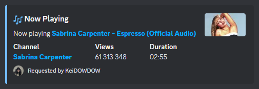
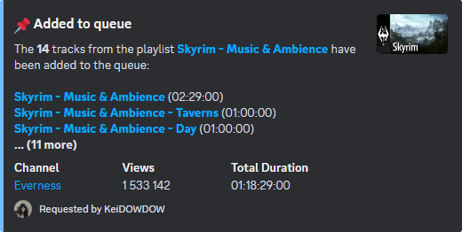
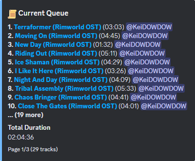

# 🎶 AlvesMusic - A Discord Music Bot Playing from YouTube

AlvesMusic is a simple yet powerful Discord music bot that allows you to **play music from YouTube**
directly in your voice channels.

## 📌 Features

- Play music from **YouTube**

- **Playback controls** (play, skip, pause, resume, ...)

- **Queue management** (remove, clear, shuffle, ...)

- **Supports playlists**

- Uses **cookies.txt** to bypass YouTube restrictions

- **Self-hosted** and **lightweight**

---

## 📸 Examples

<details>

  **<summary>Screenshots</summary>**

  - **Playing a track**

    `!play calogero 1987`

    

  - **Adding a playlist**

    `!play https://www.youtube.com/playlist?list=PLdSUTU0oamrwC0PY7uUc0EJMKlWCiku43`

    

  - **Displaying the queue**

    `!queue`

    

</details>

---

## 📥 Installation

### 1. Clone the repository

Make sure you have **Git** installed, then run:

```
git clone https://github.com/motzmartin/AlvesMusic.git
cd AlvesMusic
```

### 2. Create a virtual environment (recommended)

Using **Python virtual environment** avoids dependency conflicts:

```
python -m venv venv
```

Then, activate it:

- **Windows:**

  ```
  venv\Scripts\activate
  ```

- **Linux/macOS:**

  ```
  source venv/bin/activate
  ```

### 3. Install dependencies

Run:

```
pip install -r requirements.txt
```

The bot requires:

- `discord.py` (for Discord bot functionality)

- `yt_dlp` (to interact with YouTube)

- `python-dotenv` (to load environment variables)

- `PyNaCl` (for cryptographic operations and voice support in Discord bots)

### 4. Install FFmpeg (Required for Audio)

- **Windows:**

1. Download the latest FFmpeg "full" build from:

   [FFmpeg Download](https://ffmpeg.org/download.html)

2. Extract the contents to a directory (e.g., C:\ffmpeg).

3. Add FFmpeg to your system's PATH:

   - Search for "Edit the system environment variables" in the Start menu.

   - Click "Environment Variables".

   - Under System Variables, find and edit the Path variable.

   - Click New, then add the bin folder path (e.g., C:\ffmpeg\bin).

4. Verify the installation by running:

   ```
   ffmpeg -version
   ```

- **Linux/macOS:**

  Use your package manager to install FFmpeg:

  - Debian/Ubuntu:

    ```
    sudo apt update && sudo apt install ffmpeg
    ```

  - macOS (Homebrew):

    ```
    brew install ffmpeg
    ```

  - Arch Linux:

    ```
    sudo pacman -S ffmpeg
    ```

  - Fedora:

    ```
    sudo dnf install ffmpeg
    ```

  Verify the installation:

  ```
  ffmpeg -version
  ```

---

## ⚙️ Setup

### 1. Configure your `.env` file

Create a `.env` file in the **root directory** and add your Discord bot token:

```
BOT_TOKEN=your_discord_bot_token_here
```

### 2. Download YouTube cookies

To **bypass YouTube restrictions**, you need to **export your YouTube cookies** using a browser extension:

- **Chrome:** Install [Get cookies.txt LOCALLY](https://chromewebstore.google.com/detail/get-cookiestxt-locally/cclelndahbckbenkjhflpdbgdldlbecc)

- **Firefox:** Use a similar extension like "cookies.txt exporter"

#### Steps:

1. Go to [YouTube](https://www.youtube.com) and **log into your account**.

   ⚠️ **USE A BURNER ACCOUNT!** ⚠️

2. Use the extension to **export your cookies** as `cookies.txt`.

3. Place the `cookies.txt` file in the **root directory** of the bot.

---

## 🎮 Usage

### Run the bot

Start AlvesMusic with:

```
python main.py
```

If you're using a virtual environment, make sure it's activated before running the bot.

### Using `screen` to Keep the Bot Running (Linux)

If you want to **keep the bot running even after closing your terminal**, you can use `screen`:

1. **Create a new screen session:**

   ```
   screen -S alvesmusic
   ```

2. **Start the bot inside the screen session:**

   ```
   python main.py
   ```

3. **Detach the screen session (leave it running in the background):**

   Press `Ctrl + A`, then `D`.

4. **Reconnect to the screen session later:**

   ```
   screen -r alvesmusic
   ```

5. **To list all running screen sessions:**

   ```
   screen -ls
   ```

6. **To terminate the screen session:**

   Reconnect to it using `screen -r alvesmusic`, then exit with:

   ```
   exit
   ```

### Commands

| Command               | Description                                           |
|-----------------------|-------------------------------------------------------|
| `!play <search\|URL>` | Plays a song or adds it to the queue                  |
| `!skip [number]`      | Skips to the next song or a set number from the queue |
| `!playing`            | Shows the currently playing song                      |
| `!queue [page]`       | Displays the current queue                            |
| `!remove`             | Removes the song at the specified index               |
| `!clear`              | Clears the queue                                      |
| `!shuffle`            | Randomly shuffles the queue                           |
| `!pause`              | Pauses the current song                               |
| `!resume`             | Resumes the paused song                               |
| `!stop`               | Stops playback and clears the queue                   |

---

## 🛠 Hosting Options

AlvesMusic is **self-hosted**, meaning you can run it on:

- **Your local machine** (Windows, Linux, macOS)

- **A VPS (Virtual Private Server)** for 24/7 uptime

- **A Raspberry Pi** for a lightweight solution

---

## 🔒 Security Reminder

- **Never share your `.env` file** or Discord bot token!

- Add `.env` and `cookies.txt` to your `.gitignore` file:

```
.env
cookies.txt
```

---

## 📜 License

This project is open-source and available under the **MIT License**.

---

## 🙌 Contributing

Contributions are welcome! Feel free to fork this repository and submit a pull request. 😊

---

## 📞 Support

If you encounter any issues, feel free to **open an issue** on GitHub.

🚀 **Enjoy your music on Discord!**
